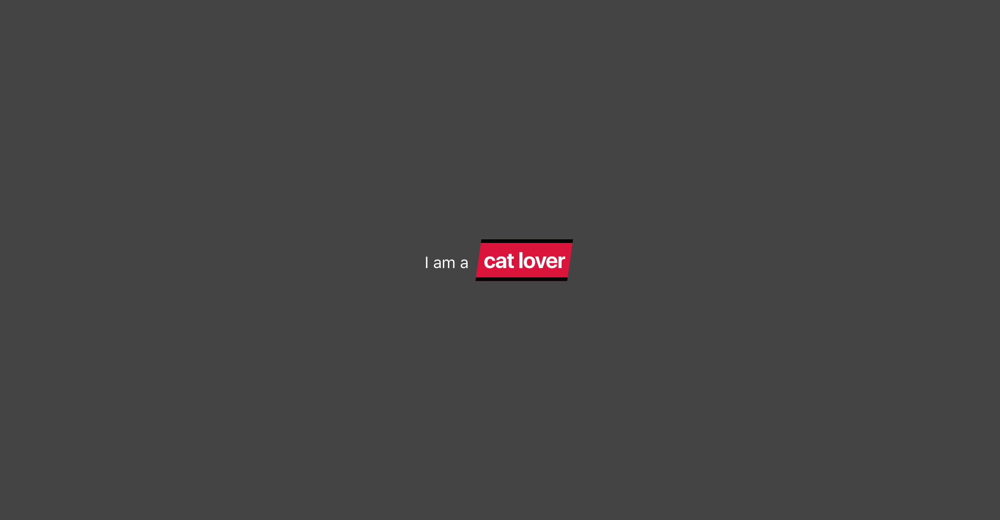

# Interactive text intro

Display a form with 1 field. The user must provide at least 3 words.

Once they have provided the words, on click on the button `Show me the message` a message should be displayed. The message should in the format `I am a <placeholder>` where the `<placeholder>` will be replaced by a word the user entered. 

If the user tries to see the message before entering 3 words, display an error message.

The word in the placeholder slot should change every 1 second. Once it reaches the end of the list of words entered, start the rotation from the begining.

Extra:

- Add a close button to go back to the form, resetting the words entered
